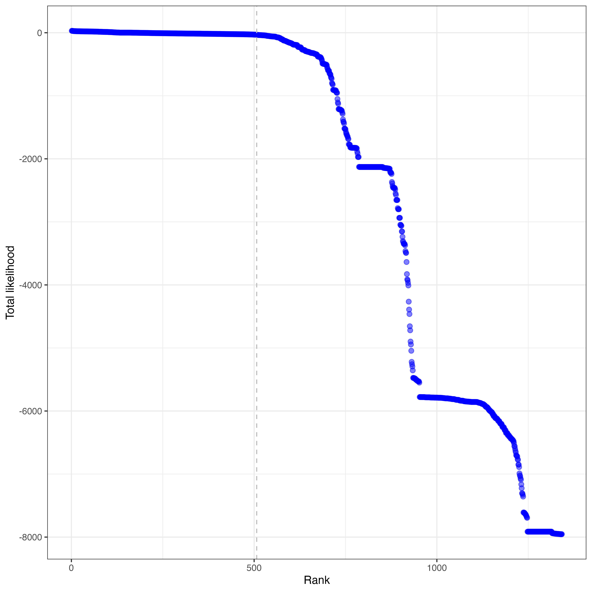
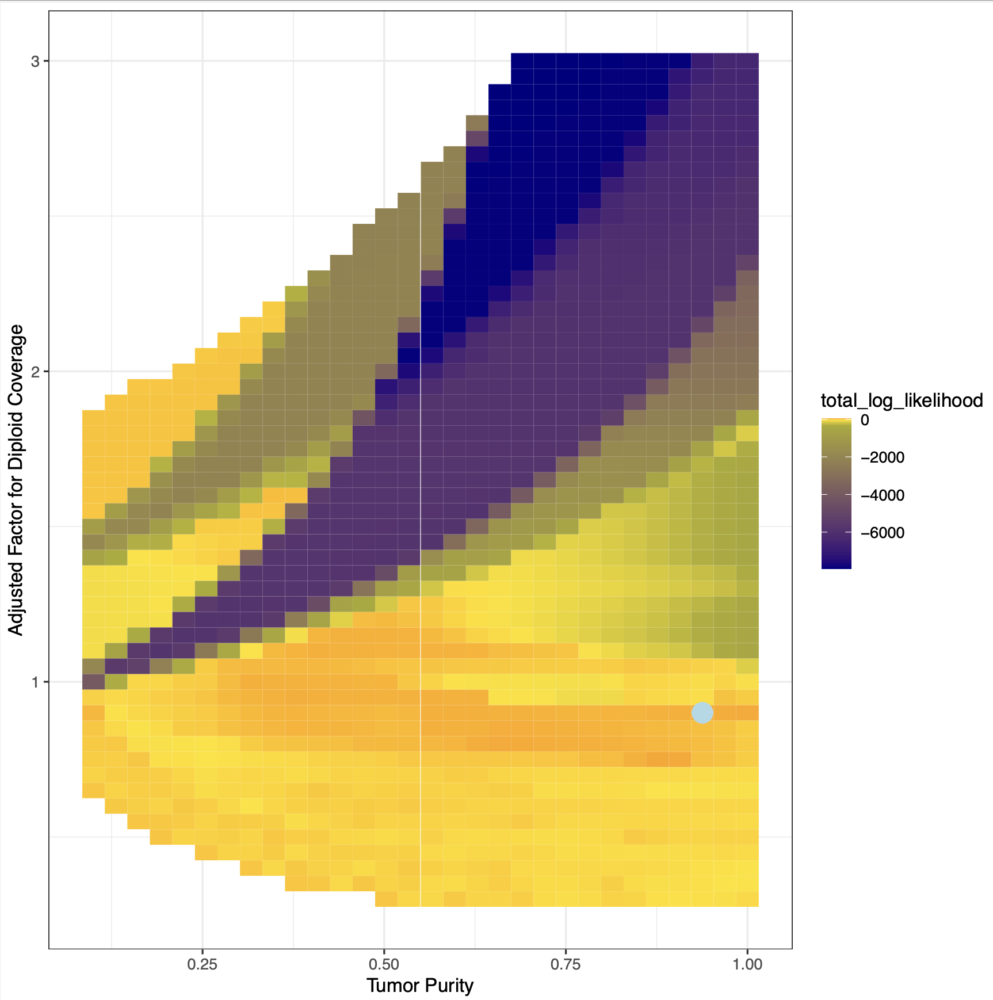
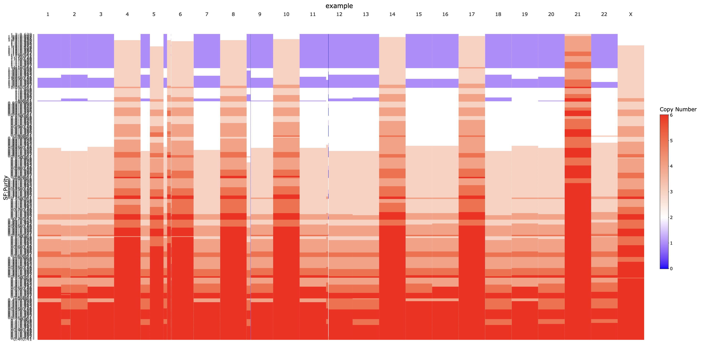
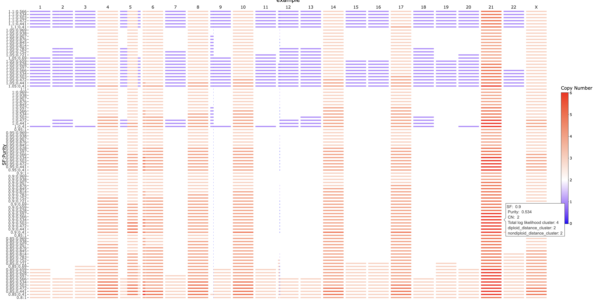
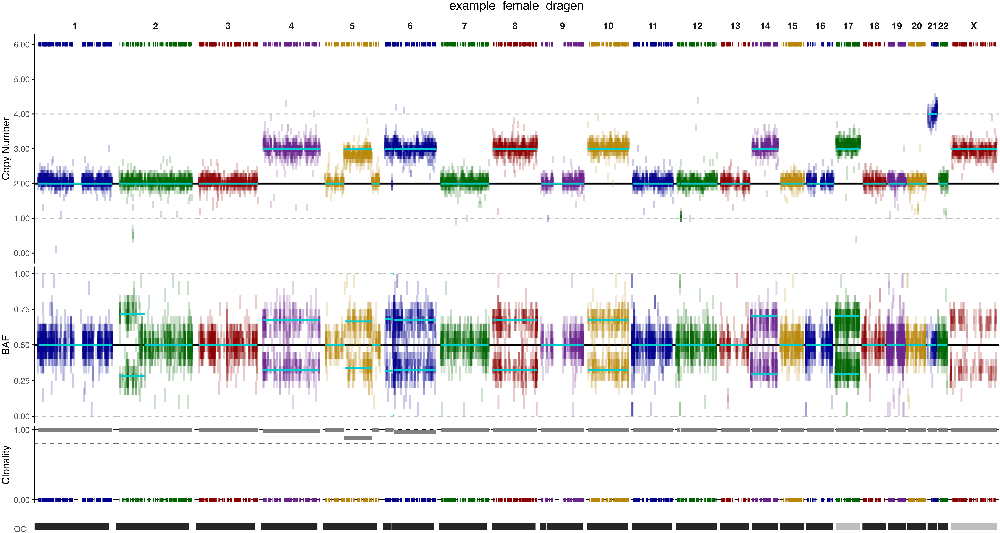

<p align="center">
  
</p>

**XploR** is an R package for robust, large-scale copy number and allelic imbalance analysis from whole exome sequencing (WES) data.  
It provides tools for segmentation, purity/ploidy estimation, allelic imbalance analysis, ISCN annotation, interactive plotting, and more.


---

## Contents

- [Features](#features)
- [Installation](#installation)
- [Test Run](#test-run)
- [Prepare input files](#prepare-input-files)
- [Prepare reference files](#Prepare-reference-files)
- [Algorithm](#algorithm)
- [Output](#output)
- [Model selection and rerun](#model-selection-and-rerun)
- [Full function and parameter list](#full-function-and-parameter-list)

---

## Features

- Exome-wide copy number segmentation and allelic imbalance detection
- Purity and ploidy estimation with model selection
- BAF and coverage smoothing, binning, and quality control
- ISCN and gene annotation of CNV segments
- Interactive and publication-ready visualization


## Installation

Install the latest version from GitHub using [devtools](https://github.com/r-lib/devtools):

```{r install, eval=FALSE} 
install.packages("devtools")
devtools::install_github("sj-cmpb-se/XploR")
```

## Quick Test run

All files needed for a test run in placed at inst/extdata folder. RunExamplePipeline() will use the files in inst/exdata for a test run.

```{r testrun, eval= FALSE}
library(XploR)
RunExamplePipeline( out_dir = "/path_to_output_dir" )
```


### Running this function is same with running the steps separately like:
  
1. Run segmentation based on Allelic imbalance information. 

```{r, eval = FALSE}
tryCatch({
  RunAIsegmentation(
    seg = seg,
    cov = cov,
    ai = ai,
    gender = gender,
    out_dir = out_dir,
    prefix = prefix,
    aibinsize = 500000,
    mergeai = 0.15,
    mergecov = 0.2,
    minaisize = 1000000,
    snpmin = 7,
    minsnpcallaicutoff = 10,
    mergecovminsize = 500000,
    aitype = "dragen"
  )
}
, error = function(e) {
  message("ERROR during segmentation: ", conditionMessage(e))
  quit(save = "no", status = 1, runLast = FALSE) 
})
```

### Parameters for `RunAIsegmentation`

| Parameter           | Type      | Description                                                      | Example Value   |
|---------------------|-----------|------------------------------------------------------------------|-----------------|
| `seg`               | character | Path to the segment file from GATK tumor only CNV run.           | `"sample.seg"`  |
| `cov`               | character | Path to the coverage file from GATK tumor only CNV run.          | `"sample.counts"`|
| `ai`                | character | Path to the allelic count file from DRAGEN/GATK or other sources.| `"sample.baf"`  |
| `gender`            | character | Sample gender (`"male"` or `"female"`)                           | `"female"`      |
| `out_dir`           | character | Output directory                                                 | `"results/"`    |
| `prefix`            | character | Prefix for output files                                          | `"Sample1"`     |
| `aibinsize`         | numeric   | Bin size for allelic imbalance, default is 500,000.              | `500000`        |
| `mergeai`           | numeric   | AI segment merge threshold, default is 0.15.                     | `0.15`          |
| `mergecov`          | numeric   | Coverage segment merge threshold, default is 0.2.                | `0.2`           |
| `minaisize`         | numeric   | Minimum reportable AI segment size, default is 1,000,000.        | `1000000`       |
| `snpmin`            | integer   | Minimum SNPs per AI segment, default is 7 for WES.               | `7`             |
| `minsnpcallaicutoff`| integer   | Minimum SNPs to call AI segment, default is 10 for WES.          | `10`            |
| `mergecovminsize`   | numeric   | Minimum coverage segment size after merging, default is 500,000.  | `500000`        |
| `aitype`            | character | Type of AI input (`"dragen"`, `"gatk"`, or `"other"`)            | `"dragen"`      |

2. Run model likelihood calculation and selection.
```{r, eval = FALSE}
tryCatch({
  RunModelLikelihood(
    seg = paste0(out_dir,"/",prefix,"_GATK_AI_segment.tsv"),
    out_dir = out_dir,
    prefix = prefix,
    gender = gender,
    lambda = 1,
    gamma = 1,
    epsilon = 0.01,
    modelminprobes = 20,
    modelminAIsize = 5000000,
    minsf = 0.4,
    callcov = 0.3,
    thread = 6)

}, error = function(e) {
  message("ERROR during likelihood calculation: ", conditionMessage(e))
  quit(save = "no", status = 1, runLast = FALSE) 
})
```

### Parameters for `RunModelLikelihood`

| Parameter             | Type      | Description                                                                                  | Example Value                        |
|-----------------------|-----------|----------------------------------------------------------------------------------------------|--------------------------------------|
| `seg`                 | character | Path to the combined segment file (e.g., output from segmentation step above                 | `"results/Sample1_GATK_AI_segment.tsv"` |
| `out_dir`             | character | Output directory for results                                                                 | `"results/"`                         |
| `prefix`              | character | Prefix for output files                                                                      | `"Sample1"`                          |
| `gender`              | character | Sample gender (`"male"` or `"female"`)                                                       | `"female"`                           |
| `lambda`              | numeric   | Exponential decay parameter for the likelihood model                                         | `1`                                  |
| `gamma`               | numeric   | Weight for the prior in the likelihood calculation                                           | `1`                                  |
| `epsilon`             | numeric   | Small value to avoid log(0) and zero parameters in beta distribution                         | `0.01`                               |
| `modelminprobes`      | integer   | Minimum number of probes/SNPs per segment to include in modeling                             | `20`                                 |
| `modelminAIsize`      | numeric   | Minimum segment size (bp) to include in modeling                                             | `5000000`                            |
| `minsf`               | numeric   | Minimum scale factor to consider in model selection                                          | `0.4`                                |
| `callcov`             | numeric   | Subclonal events calling cutoff based on total copy number                                   | `0.3`                                |
| `thread`              | integer   | Number of CPU threads to use for parallel processing                                         | `6`                                  |
| `callcovcutoff`       | numeric   | (Optional) Threshold for calling without modeling.                                           | `0.3`                                |
| `callaicutoff`        | numeric   | (Optional) Threshold for calling without modeling.                                           | `0.3`                                |
| `minsnpcallaicutoff`  | integer   | (Optional) Minimum SNPs to call AI segment                                                   | `10`                                 |

**Notes:**  
- Parameters marked as (Optional) can be omitted and have defaults.
- For a full description of all arguments and advanced options, see the function reference or `?RunModelLikelihood` in R.


3. Run annotation segments.
```{r, eval = FALSE}
tryCatch({
  AnnotateSegments(
    input = paste0(out_dir,"/",prefix,"_final_calls.tsv"),
    out_dir = out_dir,
    prefix = prefix,
    cytoband = cytoband,
    whitelist_edge = whitelist_edge,
    gene = gene)
}, error = function(e) {
  message("ERROR during segment annotation: ", conditionMessage(e))
  quit(save = "no", status = 1, runLast = FALSE) 
})
```

### Parameters for `AnnotateSegments`

| Parameter        | Type      | Description                                                                                 | Example Value                      |
|------------------|-----------|---------------------------------------------------------------------------------------------|------------------------------------|
| `input`          | character | Path to XploR CNV calling output.                                                           | `"results/Sample1_final_calls.tsv"`|
| `out_dir`        | character | Output directory for results                                                                | `"results/"`                       |
| `prefix`         | character | Prefix for output files                                                                     | `"Sample1"`                        |
| `cytoband`       | character | Path to cytoband annotation file (TSV). See [Prepare input](#prepare-input) for detail.     | `"data/cytoBand.txt"`              |
| `whitelist_edge` | character | Path to detectable edge for each chromosomes.See [Prepare input](#prepare-input) for detail.| `"data/whitelist.txt"`             |
| `gene`           | character | Path to gene annotation file. See [Prepare input](#prepare-input) for detail.               | `"data/gene_anno.txt"`             |

4. Generating CNV plot
```{r, eval = FALSE}
tryCatch({
  RunPlotCNV(
    seg = paste0(out_dir,"/",prefix,"_CNV_annotation.tsv"),
    cr =cr,
    ballele = ai,
    ai_binsize = 100000,
    cov_binsize = 100000,
    whitelist = whitelist_bed,
    gender = gender,
    out_dir = out_dir,
    prefix = prefix,
    aitype = "dragen"
  )
  }, error = function(e) {
    message("ERROR during generate CNV plot: ", conditionMessage(e))
    quit(save = "no", status = 1, runLast = FALSE) # Exits the workflow with error status
})

```
### Parameters for `RunPlotCNV`

| Parameter      | Type      | Description                                                                                            | Example Value                          |
|----------------|-----------|--------------------------------------------------------------------------------------------------------|----------------------------------------|
| `seg`          | character | Path to final annotated call file.                                                                     | `"results/Sample1_CNV_annotation.tsv"` |
| `cr`           | character | Path to the GATK denoised copy ratio file with extension `.denoisedCR.tsv`                             | `"data/sample.denoisedCR.tsv"`         |
| `ballele`      | character | Path to the B-allele file (from DRAGEN, GATK, or other source). See `aitype` for required columns.     | `"data/sample.tumor.baf.gz"`           |
| `ai_binsize`   | numeric   | Bin size for AI plot (default: 100,000)                                                                | `100000`                               |
| `cov_binsize`  | numeric   | Bin size for coverage plot (default: 100,000)                                                          | `100000`                               |
| `whitelist`    | character | Path to whitelist file for regions to include                                                          | `"data/whitelist.txt"`                 |
| `gender`       | character | Sample gender (`"male"` or `"female"`)                                                                 | `"female"`                             |
| `out_dir`      | character | Output directory for plot                                                                              | `"results/"`                           |
| `prefix`       | character | Sample ID or output prefix                                                                             | `"Sample1"`                            |
| `aitype`       | character | Type of allelic imbalance data: `"gatk"`, `"dragen"`, or `"other"`.                                    | `"dragen"`                             |

5. Generating AI segment quality file. 
```{r, eval = FALSE}
tryCatch({
  BafQC(
    annofile = paste0(out_dir,"/",prefix,"_CNV_annotation.tsv"),
    out_dir = out_dir,
    prefix = prefix)
},error = function(e) {
  message("ERROR during generate quality control table: ", conditionMessage(e))
  quit(save = "no", status = 1, runLast = FALSE) # Exits the workflow with error status
})


```
### Parameters for `BafQC`

| Parameter   | Type      | Description                                                      | Example Value                        |
|-------------|-----------|------------------------------------------------------------------|--------------------------------------|
| `annofile`  | character | Path to the CNV annotation file (e.g., *_CNV_annotation.tsv)     | `"results/Sample1_CNV_annotation.tsv"` |
| `out_dir`   | character | Output directory for the QC summary file                         | `"results/"`                         |
| `prefix`    | character | Prefix for the QC output file                                    | `"Sample1"`                          |


## Prepare input files

1. Run GATK in tumor-only mode by default parameters. Below is a summary of the GATK tumor-only mode command used in our pipeline. Please see the [GATK website](https://gatk.broadinstitute.org/) for details. Files will be used in XploR is sample.counts, sample.called.seg, sample.allelic_counts and sample.denoisedCR.tsv. 
2. The allelic count file also could generate by other software like DRAGEN or samtools. 

### Supporting allelic count file format
| aitype parameter value   | software              | minimum columns                                                        | File extention                       |
|--------------------------|-----------------------|------------------------------------------------------------------------|--------------------------------------|
| `dragen`                 | Illumina DRAGEN       | contig, start, refAllele, allele2, allele1Count,allele2Count           | `"sample..tumor.ballele.counts.gz"`  |
| `gatk`                   | GATK                  | CONTIG, POSITION, ALT_COUNT, REF_COUNT, REF_NUCLEOTIDE, ALT_NUCLEOTIDE | `"sample.allelic_counts"`            |
| `other`                  | Other (e.g. samtools) | CONTIG, POSITION, ALT_COUNT, REF_COUNT, REF_NUCLEOTIDE, ALT_NUCLEOTIDE |  `""`                                |

## Prepare reference files

1. Panel of Normals (PON):
A Panel of Normals is required and should be generated using GATK. For detailed instructions, see the [GATK website](https://gatk.broadinstitute.org/). Note: Male and female PON files need to be generated separately.

2. Gene annotation:
Gene annotation can be obtained from various sources (e.g., Ensembl, UCSC, Gencode, RefSeq). An example file is included with the package:
```{r, eval = FALSE}
gene <- system.file("extdata", "RefSeqCurated.genePred.gene_region.txt", package = "XploR")
head(read.table(gene, header = TRUE, sep = "\t"))
```

3. Cytoband annotation:
Cytoband annotation files are typically downloaded from UCSC. An example file is included:
```{r,eval = FALSE}
cytoband <- system.file("extdata", "hg19_cytoBand.dat", package = "XploR")
head(read.table(cytoband, header = TRUE, sep = "\t"))
```

4. Whitelist, Blacklist, and Detectable Boundary Files:
These files are generated based on the GATK Panel of Normals. See the function documentation in R: `?PonProcess` or `help("PonProcess", package = "XploR")`. Example usage:
```{r, eval = FALSE}
PonProcess(pon_file = pon_hdh5_file,
           blacklist_bed = output_blacklist_bed,
           whitelist_bed = output_whitelist_bed,
           cytoband = cytoband,
           detectable_edge = output_detectable_edge,
           gender = gender
          )
```

## Altorithm

### AI Segmentation Workflow
For each GATK segment, the workflow refines breakpoints using BAF/MAF data by dividing the segment into bins of user-defined size (aibinsize). Within each bin, Gaussian mixture modeling (GMM) is applied to identify clusters in the MAF distribution. Adjacent bins are merged if their MAF means are within a specified threshold (mergeai) or if quality criteria are not met, and segments with insufficient SNPs or small size are filtered out. Each resulting segment is then assigned a quality tag ("PASS" or "FAILED") based on the GMM weight and SNP count.

### Purity and diploid coverage scale factor estimation
#### Prior assignment based on parsimony principle
Priors are assigned to each potential copy number combination based on the **principle of parsimony**, which favors simpler (biologically less complex) allele configurations. The biological difficulty level reflects the number of steps required to reach a given allele combination from the baseline diploid state (1,1), where each step represents either a gain or loss of one allele.

- **Baseline State:** The diploid state (1,1) is assigned a difficulty level of 1.
- **Single-Step Changes:** Combinations reachable from (1,1) in one step (single gain or loss) are assigned a difficulty level of 2.
- **Two-Step Changes:** Combinations requiring two steps (e.g., loss then gain, or two sequential gains) receive a difficulty level of 3.
- **Three-, Four-, Five-Step Changes:** Difficulty levels increase with the number of steps, up to 6 for the most complex.
- **Special Considerations:**
    - **Whole Chromosome Duplication:** Combinations like (2,2) are assigned higher difficulty due to their rarity.
    - **Sequential Gains:** Combinations with sequential gains of the same chromosome (e.g., (3,1)) are considered less difficult than those involving loss followed by gain (e.g., (2,0)).
The prior for each allele combination is calculated using an exponential decay function controlled by a decay rate parameter λ.
prior = exp(-λ × Bio_diff)
where **Bio_diff** is the assigned biological difficulty score for the copy number configuration.

#### Tumor Copy Number Estimation

For each genomic segment, the model computes a range of possible tumor-specific copy numbers (`CN_tumor`) that could result from observed data under different cancer cell fractions (ccf):

- **Tumor Copy Number Formula:**

$$
CN_{tumor} = \frac{C_i \times 2 / (\mu \times 100) - (1 - \rho) \times 2 - \rho \times (1 - ccf) \times 2}{\rho \times ccf}
$$

where:

 - $C_i$: Observed segment copy number
 - $\mu$: Diploid coverage scale factor
 - $\rho$: Tumor purity
 - $ccf$: Cancer cell fraction

 - **Combination Generation:**  
  For each potential tumor CN, all feasible major and minor allele combinations are generated and filtered based on biological plausibility.

 - **CCF Value Calculation:**  
  For non-diploid segments, CCF is calculated; for diploid segments, it is set as NA.

#### Likelihood Calculation

 - **BAF Likelihood:**  
  For each combination, the B allele frequency likelihood is computed using the beta distribution, parameterized by $\alpha$ and $\beta$, derived from the expected BAF:

$$
\mathrm{Beta}(\alpha, \beta)
$$

where:

 - $\alpha = K \times \mathrm{BAF} + \epsilon$
 - $\beta = K \times (1 - \mathrm{BAF}) + \epsilon$
 - $K$: Scaling factor controlling distribution precision
 - $\epsilon$: Small positive value for numerical stability

- **Posterior Likelihood:**  
The posterior likelihood for each combination incorporates both the BAF likelihood and the prior, weighted by a factor $\gamma$:

$$
\text{Posterior Likelihood} = \text{BAF Likelihood} \times (\text{Prior})^\gamma
$$

where:

- $\text{BAF Likelihood}$: Likelihood of the observed B-allele frequency under the current model  
- $\text{Prior}$: Prior probability assigned to the allele combination based on biological plausibility  
- $\gamma$: Weighting factor controlling the influence of the prior in the posterior calculation  


#### Purity and Diploid Coverage Scale Factor Estimation

A grid of candidate tumor purity (\(\rho\)) and diploid coverage scale factor (\(\mu\)) values is generated. For each (\(\mu\), \(\rho\)) pair, the model calculates the total log-likelihood across all segments, considering only biologically feasible configurations and ccf values. The best-fitting model is selected based on the highest total log-likelihood and the smallest distance between segment copy numbers and integer values, in accordance with the parsimony principle.


#### Assigning Calls for Each Segment

The `SelectCallpersegment()` function refines and selects the most likely allele combinations for each genomic segment, handling both clonal and subclonal events, and incorporates coverage differences and prior knowledge.

- **Initialization and Preprocessing:**
    - Replace any zero BAF likelihoods with a minimum likelihood value to ensure all terms contribute meaningfully.
    - Compute expected coverage for each model and the difference (`cov_diff`) from observed coverage.

- **Selection of Top Likelihood Models:**
    - For each segment, identify the top two models with the highest BAF likelihoods.
    - If a subclonal event is likely (e.g., the second-ranked model has ccf > 0.3 and comparable likelihood), select it as a subclonal event.
    - If both major and minor copy numbers are equal, selection is based on `cov_diff`.

- **Handling Models with `minor = 0`:**
    - For segments with `minor = 0`, where BAF likelihood is unreliable, select the model with the smallest `cov_diff`.
    - Ensure consistency in selection for both `minor = 0` and `minor ≠ 0` cases.

- **Post-Processing:**
    - Calculate and store the log-transformed likelihood value (`log_BAF_likelihood`) for each selected model.


## Output
#### Segmentation output
sample_GATK_AI_segment.tsv ( Generared by `?RunAIsegmentation` function)

| Column            | Type      | Description                                                                                             | Example_value      |
|-------------------|-----------|---------------------------------------------------------------------------------------------------------|--------------------|
| Sample            | character | Sample identifier                                                                                       | `Sample1`          |
| Chromosome        | character | Chromosome name                                                                                         | `1`                |
| Start             | integer   | Start position (base pair)                                                                              | `123456`           |
| End               | integer   | End position (base pair)                                                                                | `234567`           |
| Num_Probes        | integer   | Number of probes/SNPs in the segment                                                                    | `25`               |
| Segment_Mean      | numeric   | Segment mean (log2 ratio) from CNV analysis                                                             | `0.42`             |
| gatk_SM_raw       | numeric   | Raw segment mean from GATK                                                                              | `0.38`             |
| gatk_count        | integer   | Number of counts in GATK segment                                                                        | `30`               |
| gatk_baselinecov  | numeric   | The GATK baseline is an intermediate value calculated using gatk_SM_raw and gatk_count.                 | `100.5`            |
| gatk_gender       | character | Gender as reported by GATK                                                                              | `female`           |
| pipeline_gender   | character | Gender as used in pipeline                                                                              | `female`           |
| MAF               | numeric   | Minor allele frequency for the segment                                                                  | `0.21`             |
| MAF_Probes        | integer   | Number of probes used to calculate MAF                                                                  | `18`               |
| MAF_gmm_G         | integer   | Number of GMM clusters in MAF distribution                                                              | `2`                |
| MAF_gmm_weight    | numeric   | Mixture weight of the main GMM cluster                                                                  | `0.85`             |
| size              | integer   | Segment size in base pairs                                                                              | `111111`           |
| BreakpointSource  | character | Source of breakpoint (`GATK` or `Postprocess`)                                                          | `GATK`             |
| FILTER            | character | Quality tag for the segment (`PASS` or `FAILED`)                                                        | `PASS`             |


#### Raw likelihood results under each configuration
sample_likelihood_raw.tsv (Generated by `?RunModelLikelihood()` function)

| Column           | Type      | Description                                                                                                     | Example_value |
|------------------|-----------|-----------------------------------------------------------------------------------------------------------------|---------------|
| major            | integer   | Major allele copy number                                                                                        | `2`           |
| minor            | integer   | Minor allele copy number                                                                                        | `1`           |
| CN               | integer   | Total copy number (major + minor)                                                                               | `3`           |
| ccf              | numeric   | Cancer cell fraction                                                                                            | `0.85`        |
| Bio_diff         | integer   | Biological difficulty score for the allele combination                                                          | `3`           |
| prior            | numeric   | Prior probability for the allele combination                                                                    | `0.12`        |
| expected_maf     | numeric   | Expected minor allele frequency for this configuration                                                          | `0.21`        |
| maf_ll           | numeric   | Log-likelihood for the observed MAF under this configuration                                                    | `-0.56`       |
| weighted_prior   | numeric   | Weighted log-prior (prior × gamma)                                                                              | `-2.13`       |
| exp_maf_ll       | numeric   | Exponentiated MAF log-likelihood                                                                                | `0.57`        |
| exp_prior        | numeric   | Exponentiated weighted prior                                                                                    | `0.11`        |
| MAF_likelihood   | numeric   | Posterior likelihood for this configuration                                                                     | `0.065`       |
| Segcov           | numeric   | Pseudo Segment coverage                                                                                         | `280`         |
| MAF              | numeric   | Observed minor allele frequency                                                                                 | `0.19`        |
| mu               | numeric   | Diploid coverage scale factor                                                                                   | `1.0`         |
| rho              | numeric   | Tumor purity (fraction between 0 and 1)                                                                         | `0.7`         |
| index            | character | Segment index or identifier                                                                                     | `"12"`        |
| Tag              | character | Segment inclusion/exclusion tag for summarizing total likelihood for a model (e.g., `"Include"`, `"Exclude"`)   | `"Include"`   |
| ccf_MAF          | numeric   | Cancer cell fraction estimated from MAF and allele configuration only                                           | `0.81`        |


#### Allelic combiantion ressult with maximum likelihood under each configuration
sample_top_likelihood_calls.tsv ( Generated by `?SelectCallpersegment()` function )
The format is simillar with `sample_likelihood_raw.tsv`, with best allelic combiantion is selected for each segment under each diploid coverage scale factor and tumor purity configuration.

#### Likelihood for each combination of diploid coverage scale factor and tumor purity 
sample_Models_likelihood.tsv ( Generated by `?SelectFinalModel()` function )

| Column                          | Type      | Description                                                                                 | Example_value   |
|----------------------------------|-----------|---------------------------------------------------------------------------------------------|-----------------|
| mu                               | numeric   | Diploid coverage scale factor (model parameter)                                             | `1.0`           |
| rho                              | numeric   | Tumor purity (model parameter, fraction between 0 and 1)                                    | `0.7`           |
| total_log_likelihood_before_refine | numeric | Total log-likelihood for the model before refinement                                        | `-1234.5`       |
| segments_n                       | integer   | Number of segments included in the model                                                    | `27`            |
| Likelihood_penalty_rows          | integer   | Number of segments penalized due to failed likelihood calculation                           | `2`             |
| total_log_likelihood_after_refine  | numeric | Total log-likelihood for the model after refinement                                         | `-1220.2`       |
| diploid_n                        | integer   | Number of diploid segments in the model                                                     | `15`            |
| diploid_distance_to_integer      | numeric   | Mean distance to integer copy number for diploid segments                                   | `0.04`          |
| nondiploid_n                     | integer   | Number of non-diploid segments in the model                                                 | `12`            |
| nondiploid_distance_to_integer   | numeric   | Mean distance to integer copy number for non-diploid segments                               | `0.11`          |
| total_distance_to_integer        | numeric   | Sum of diploid and non-diploid mean distances to integer copy number                        | `0.15`          |
| ploidy                           | numeric   | Mean copy number (ploidy) across all segments                                               | `2.4`           |
| Tier1                            | character | Model tier label (e.g., `"Tier1_Models"`, `"Final_model_MAF"`)                              | `"Tier1_Models"`|
| total_likelihood_cluster         | integer   | Rank based on total likelihood ( lower is better )                                          | `1`             |
| diploid_distance_cluster         | integer   | Rank based on diploid distance to integer copy number ( lower is better )                   | `1`             |
| nondiploid_distance_cluster      | integer   | Rank based on non-diploid distance to integer copy number (lower is better)                 | `1`             |
| total_likelihood_cluster_mean    | numeric   | Mean total log-likelihood for the level                                                     | `-1200.0`       |
| diploid_distance_cluster_mean    | numeric   | Mean diploid distance to integer for the level                                              | `0.03`          |
| nondiploid_distance_cluster_mean | numeric   | Mean non-diploid distance to integer for the level                                          | `0.10`          |


#### Final output of CNV calling
sample_final_calls.tsv (Generated by `?RunModelLikelihood()` function)

| Column            | Type      | Description                                                        | Example_value          |
|-------------------|-----------|--------------------------------------------------------------------|------------------------|
| Chromosome        | character | Chromosome name                                                    | `1`                    |
| Start             | integer   | Start position (base pair)                                         | `3301463`              |
| End               | integer   | End position (base pair)                                           | `247784114`            |
| size              | integer   | Segment size (bp)                                                  | `244367069`            |
| Num_Probes        | integer   | Number of probes from GATK segment file                            | `222`.                 |
| Call              | character | Copy number call (e.g., `REF`, `GAIN`, `LOSS`,`GAINLOH`,`CNLOH`)   | `REF`                  |
| ccf_COV           | numeric   | Cancer cell fraction estimated from coverage                       | `1`                    |
| ccf_MAF           | numeric   | Cancer cell fraction estimated from MAF                            | `0`                    |
| ccf_final         | numeric   | Final cancer cell fraction after refinement                        | `1`                    |
| Segment_Mean      | numeric   | Final Segment mean (log2 ratio)                                    | `0.057631093`          |
| CNF_correct       | numeric   | Purity corrected copy number estimate from coverage                | `2.086898584`          |
| major             | integer   | Major allele copy number                                           | `1`                    |
| minor             | integer   | Minor allele copy number                                           | `1`                    |
| CN                | integer   | Total copy number (major + minor)                                  | `2`                    |
| MAF               | numeric   | Observed minor allele frequency                                    | `0.5`                  |
| MAF_correct       | numeric   | Purity corrected minor allele frequency                            | `0.5`                  |
| expected_maf      | numeric   | Expected minor allele frequency for this configuration             | `0.5`                  |
| expected_cov      | numeric   | Expected pseudo coverage for this segment                                 | `90`                   |
| MAF_Probes        | integer   | Number of probes used for MAF calculation                          | `1110`                 |
| MAF_gmm_G         | integer   | Number of GMM clusters in MAF distribution                         | `5`                    |
| MAF_gmm_weight    | numeric   | Mixture weight of the main GMM cluster                             | `0.667871528`          |
| BreakpointSource  | character | Source of breakpoint (`GATK` or `Postprocess`)                     | `GATK`                 |
| FILTER            | character | Quality tag for the segment (`PASS` or `FAILED`)                   | `PASS`                 |
| maf_ll            | numeric   | Log-likelihood for the observed MAF                                | `2.625299941`          |
| MAF_likelihood    | numeric   | Posterior likelihood for this configuration                        | `8.891628731`          |
| mu                | numeric   | Diploid coverage scale factor                                      | `0.9`                  |
| rho               | numeric   | Tumor purity (fraction between 0 and 1)                            | `0.938`                |
| index             | character | Segment index or identifier                                        | `1`                    |
| gatk_SM_raw       | numeric   | Raw segment mean from GATK                                         | `-0.094372`            |
| gatk_count        | integer   | Number of counts in GATK segment                                   | `361`                  |
| gatk_baselinecov  | numeric   | The GATK baseline is an intermediate value calculated using gatk_SM_raw and gatk_count.   | `385.4038109`          |
| gatk_gender       | character | Gender as reported by GATK                                         | `female`               |
| pipeline_gender   | character | Gender as used in pipeline                                         | `female`               |
| CN_mix            | character | Indicator for copy number mixture (`No` or `CN_Mix`)               | `No`                   |
| Model_source      | character | Source of model selection (`Coverage`, `Coverage + MAF`, `Diploid` )    | `Coverage + MAF`       |

#### Model selection plots

**Likelihood dot plot:**

The plot displays the likelihood ranking for all combinations of diploid coverage scale factor and tumor purity. The vertical dashed line indicates the likelihood cutoff used to define Tier 1 models. 


**Model plot:**

The model plot displays the likelihood values of different models, which are calculated based on potential combinations of diploid coverage scale factor and tumor purity. In the plot, red indicates higher likelihood, while blue signifies lower likelihood. The light blue dot indicates the final model selected by XploR. 

**Tier1 Models Overall:**

This plot shows copy number calls for each combination of diploid coverage scale factor and tumor purity. Red indicates gain, blue indicates loss, and white indicates no change. Each configuration is labeled on the y-axis. By evaluating coverage and allelic imbalance patterns in this overview, you can identify the reasonable range of diploid coverage scale factors and tumor purity values. This helps guide reruns with optimized parameter ranges if needed.

**Tier1 Models Zoom in:**

A zoomed-in view that makes the y-axis configurations more visible for detailed inspection.

#### QC Summary Table 
sample_PASS_STAT_chr.txt ( Generated by `?BafQC()` function )

| Column                | Type      | Description                                                        | Example_value |
|-----------------------|-----------|--------------------------------------------------------------------|--------------|
| chrom                 | character | Chromosome name (e.g., `1`, `2`, ..., `X`, `Y`)                    | `1`          |
| FILTER                | character | Segment filter status                                              | `PASS`       |
| Total_segment_count   | integer   | Total number of segments on the chromosome                          | `25`         |
| PASS_Seg_Count        | integer   | Number of segments with `PASS` filter status                        | `20`         |
| PASS_Seg_Percent      | numeric   | Percentage of segments with `PASS` status (0–1)                     | `0.80`       |
| Total_segment_size    | integer   | Total size (bp) of all segments on the chromosome                   | `249250621`  |
| PASS_Seg_Size         | integer   | Total size (bp) of `PASS` segments on the chromosome                | `199400497`  |
| PASS_Seg_Size_Percent | numeric   | Percentage of total segment size that is `PASS` (0–1)               | `0.80`       |

#### Annotation file 
sample_CNV_annotation.tsv ( Generated by `?AnnotateSegments()` function, only unique columns are listed ).

ISCN calculation rules:
1.	All segments will be reported with start and end cytoband in ISCN format. however certain considerations are made for the position of the centromere: 
a. In metacentric chromosomes, if a segment crosses the centromere and the gaps between the segment and the telomere on both sides are less than 5MB, only the chromosome number will be reported. 
b. In metacentric chromosomes, if a segment does not cross the centromere, and the gaps between the segment and the centromere and the telomere are both less than 5MB, the chromosome number followed by 'p' or 'q' will be reported. 
c. In acrocentric chromosomes, if the segment fulfills rule 'b' above, only the chromosome number will be reported.

| Column            | Type      | Description                                                                    | Example_value      |
|-------------------|-----------|--------------------------------------------------------------------------------|--------------------|
| p_chromStart      | integer   | Detectable start position of p arm                                             | `10`               |
| p_chromEnd        | integer   | Detectable end position of p arm                                               | `121535434`        |
| p_first_name      | character | Detectable name of first cytoband in p arm                                     | `p36.33`           |
| p_last_name       | character | Detectable name of last cytoband in p arm                                      | `p11.2`            |
| q_chromStart      | integer   | Detectable Start position of q arm                                             | `121535435`        |
| q_chromEnd        | integer   | Detectable end position of q arm                                               | `247784114`        |
| q_first_name      | character | Detectable name of first cytoband in q arm                                     | `q11.1`            |
| q_last_name       | character | Detectable name of last cytoband in q arm                                      | `qter`             |
| p_gap_to_tel      | integer   | Gap from segment start to p arm telomere                                       | `0`                |
| p_gap_to_cen      | integer   | Gap from segment end to p arm centromere                                       | `10000`            |
| q_gap_to_tel      | integer   | Gap from segment end to q arm telomere                                         | `0`                |
| q_gap_to_cen      | integer   | Gap from segment start to q arm centromere                                     | `10000`            |
| ISCN              | character | ISCN-style cytogenetic annotation                                              | `1p36.33-p11.2`    |
| Gene              | character | Overlapping gene(s) in the segment                                             | `TP53`             |
| Gene_count        | integer   | Number of overlapping genes                                                    | `1`                |


#### CNV plot
sample_CNV_plot.png ( Generated by `?RunPlotCNV()` function).

The CNV Plot shows a genome-wide summary of the copy number (top track), B-allele frequency (BAF, second track) data, tumor fraction( ccf, third tract ) and quality of segment ( bottom track). The Copy Number (CN), on the Y-axis, is a linear count of the number of copies of each chromosome in the tumor cells, taking tumor purity and tumor fraction into account. Each chromosome is plotted as a set of dots that collectively show the estimated sequence coverage for the chromosome, and as a narrow turquoise line that shows the final CN call for the chromosome. 
The BAF plot shows the variant allele fraction of SNPs across the genome with the same coloration used in the Copy Number plot. When the copy number of a chromosome changes, the BAF plot for an affected chromosome splits due to imbalance in chromosome counts. The variance of B-allele frequencies is quite high so the splitting of the BAF may be difficult to discern. To assist with interpreting the BAF plot, a turquoise line is drawn at the median level to show the imbalance.


## Model selection and rerun 

## Full function and parameter list
For a complete list of all functions and their parameters, please visit the [XploR function reference](https://sj-cmpb-se.github.io/XploR/reference/index.html).

Each function page includes detailed parameter descriptions, usage examples, and links to related documentation.

